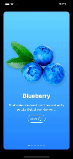

# Fructus 
```fructos is a SwiftUI application for day to day learning SwiftUI process```

* set up a new iOS project with the new SwiftUI App Life Cycle
* develop a unique Onboarding screen
* Caching in AppStorage
* save and load data using UserDefaults
* create custom Views with SwiftUI
* display multiple Views automatically with ForEach loop
* using scroll view, horizontal view, and vertical view containers
* create an outstanding Settings view
* add Icons to the App


